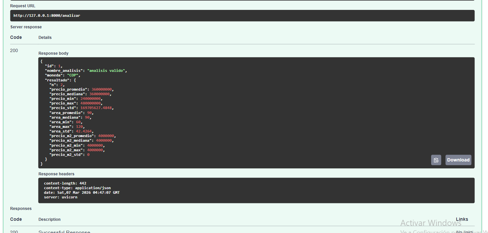
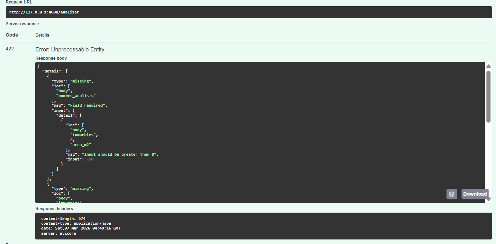
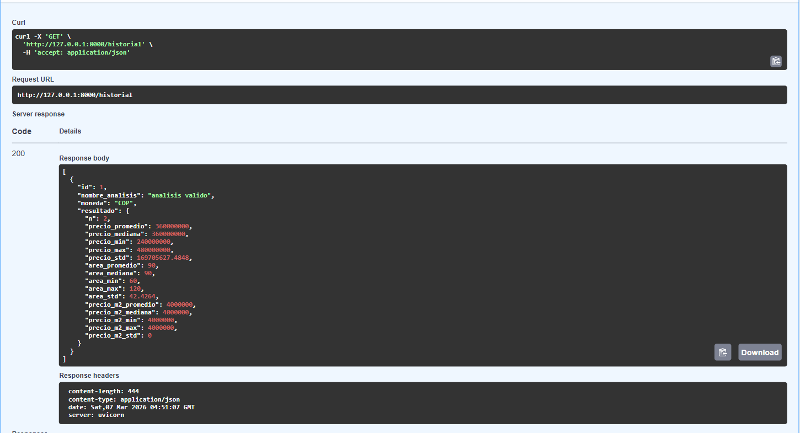
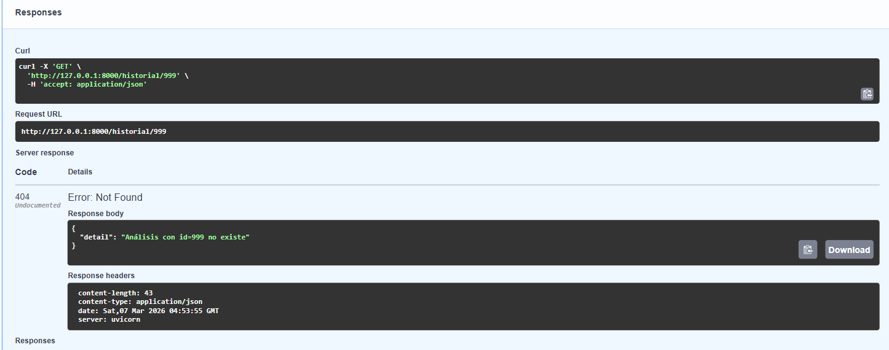
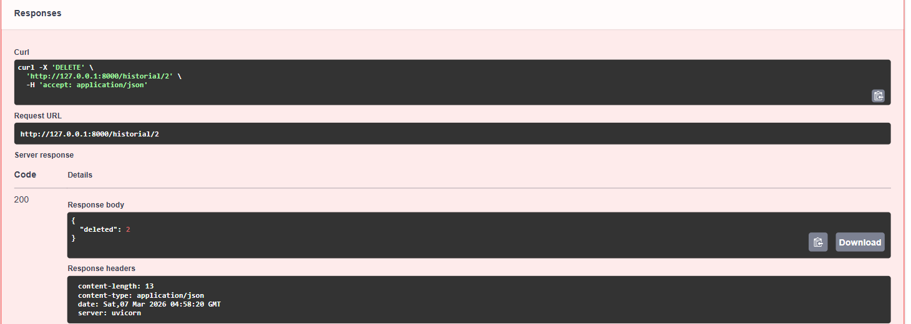

---
# 1. POST /analizar — Request exitoso

## JSON utilizado

```json
{
  "nombre_analisis": "analisis valido",
  "inmuebles": [
    {
      "tipo": "apartamento",
      "area_m2": 60,
      "valor": 240000000,
      "habitaciones": 2,
      "banos": 1,
      "barrio": "Chapinero"
    },
    {
      "tipo": "casa",
      "area_m2": 120,
      "valor": 480000000,
      "habitaciones": 4,
      "banos": 3,
      "barrio": "Cedritos"
    }
  ],
  "moneda": "COP",
  "usar_limpieza": true
}
```

## Resultado en Swagger



## Explicación

En esta prueba el JSON cumple todas las validaciones definidas en los modelos Pydantic.
FastAPI recibe el request en el endpoint `/analizar`, Pydantic valida los campos y luego la API ejecuta la función de lógica `analizar_inmuebles`. Esta función calcula estadísticas como promedio, mediana, mínimo, máximo y desviación estándar utilizando **NumPy**.

El resultado se guarda en memoria dentro del diccionario `historial` y se retorna una respuesta **HTTP 200** con el análisis calculado.

---

# 2. POST /analizar — Error de validación (HTTP 422)

## JSON utilizado

```json
{
  "nombre_analisis": "error_area_negativa",
  "inmuebles": [
    {
      "tipo": "apartamento",
      "area_m2": -50,
      "valor": 250000000,
      "habitaciones": 3,
      "banos": 2,
      "barrio": "Chapinero"
    },
    {
      "tipo": "casa",
      "area_m2": 120,
      "valor": 450000000,
      "habitaciones": 4,
      "banos": 3,
      "barrio": "Cedritos"
    }
  ],
  "moneda": "COP",
  "usar_limpieza": true
}
```

## Resultado en Swagger



## Explicación

Esta prueba genera un **error HTTP 422 (Unprocessable Entity)** porque el campo `area_m2` tiene un valor negativo.

En el modelo `InmuebleInput` se definió la validación:

* `area_m2 > 0`

Cuando FastAPI recibe el request, **Pydantic detecta que el valor -50 viola esta restricción** y rechaza la solicitud antes de que llegue a la lógica de análisis. Esto evita que datos inválidos afecten los cálculos estadísticos.

---

# 3. GET /historial — Consultar análisis almacenados

## JSON utilizado

Este endpoint no requiere un cuerpo JSON, ya que es una solicitud **GET**.

## Resultado en Swagger



## Explicación

El endpoint `/historial` devuelve todos los análisis almacenados en memoria dentro del diccionario `historial`.

Cada vez que se ejecuta el endpoint `POST /analizar`, el resultado del análisis se guarda con un identificador único (`id`).
Esta solicitud permite consultar la lista completa de análisis realizados.

La respuesta es un **HTTP 200** con un arreglo de objetos que representan los análisis guardados.

---

# 4. GET /historial/99 — Error 404

## JSON utilizado

Este endpoint tampoco requiere un cuerpo JSON.
La prueba se realiza consultando un identificador inexistente.

Request realizado:

```
GET /historial/99
```

## Resultado en Swagger



## Explicación

En esta prueba se intenta consultar un análisis con **ID 99**, pero ese análisis no existe en el diccionario `historial`.

El endpoint detecta que el identificador solicitado no está almacenado y lanza una excepción utilizando:

```
HTTPException(status_code=404)
```

Por esta razón la API responde con **HTTP 404 (Not Found)** indicando que el recurso solicitado no existe.

---

# 5. DELETE /historial/{id} — Eliminación de análisis

## JSON utilizado

Este endpoint no requiere un cuerpo JSON.
Se ejecuta sobre un identificador existente.

Ejemplo:

```
DELETE /historial/1
```

## Resultado en Swagger



## Explicación

Este endpoint permite eliminar un análisis previamente almacenado en memoria.

Cuando se ejecuta `DELETE /historial/{id}`, la API busca el análisis en el diccionario `historial`.
Si el identificador existe, el registro se elimina y se devuelve una respuesta **HTTP 200** confirmando la eliminación.

Si el identificador no existe, el endpoint retorna un **HTTP 404**, indicando que el análisis solicitado no fue encontrado.

